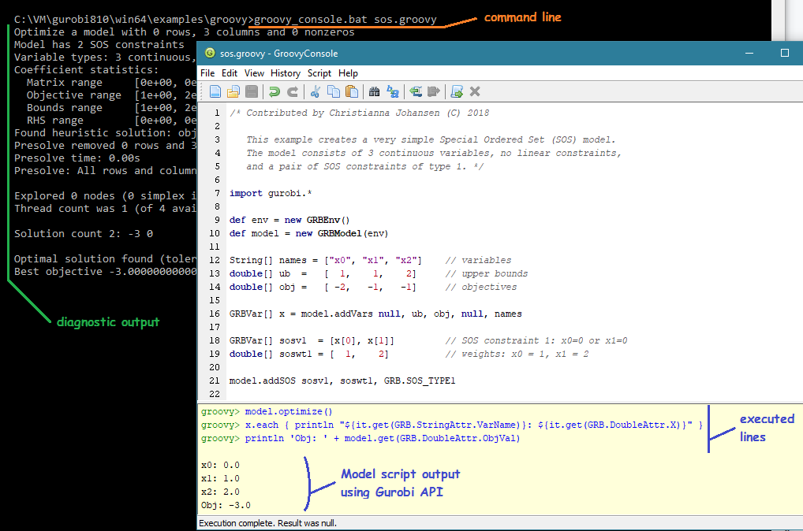

# Integrating Gurobi API with Groovy Environment

Here we will illustrate how a Groovy environment can be configured alongside Gurobi installation.
We will be using Windows as an operating system. Similar aproach can be followed under Mac OS X and Linux,
since Groovy is a multi-platform tool based on Java.
One familiar Gurobi example will show several useful features of Groovy as Gurobi programming interface.

## Helper Command Line Scripts

Let's assume the following locations for Gurobi and Groovy installation:
 * `GUROBY_DIR=c:\VM\gurobi810\win64`
 * `GROOVY_DIR=c:\Tools\groovy-2.4.7`

The following command files provide integration between Groovy environment and Gurobi installation

* [groovy_run.bat](groovy_run.bat) - running Groovy model from command line
* [sgroovy_console.bat](groovy_console.bat) - running Gurobi model inside Groovy Console interactive environment

In the following examples, we'll assume that the Gurobi model written in Groovy is located 
in the same folder as the above command scripts. Other, the command script folder can be added
to the `PATH` environment variable, or the path can be specified as part of the command script name 
in the command line.

## Model Example

For the purposes of this excercise, we will be building and solving a trivial SOS model.
For more details, please see
* [sos](sos/sos.md) - a very simple Special Ordered Set (SOS) model

To verify our results in Groovy, we will compare them with the following Python example:
* compare: [sos.py](https://www.gurobi.com/documentation/8.1/examples/sos_py.html)

Running from the `examples\python` folder:
```
examples\python> gurobi.bat ../python/sos.py
```
we get the follwoing output:

```
Optimize a model with 0 rows, 3 columns and 0 nonzeros
Model has 2 SOS constraints
Variable types: 3 continuous, 0 integer (0 binary)
Coefficient statistics:
  Matrix range     [0e+00, 0e+00]
  Objective range  [1e+00, 2e+00]
  Bounds range     [1e+00, 2e+00]
  RHS range        [0e+00, 0e+00]
Found heuristic solution: objective -0.0000000
Presolve removed 0 rows and 3 columns
Presolve time: 0.00s
Presolve: All rows and columns removed

Explored 0 nodes (0 simplex iterations) in 0.01 seconds
Thread count was 1 (of 4 available processors)

Solution count 2: 3 -0

Optimal solution found (tolerance 1.00e-04)
Best objective 3.000000000000e+00, best bound 3.000000000000e+00, gap 0.0000%
x0 0
x1 1
x2 2
Obj: 3
```

## Running Groovy Model from Command Line (Windows)

To build and solve the same model in Groovy, we use the following command line:
```
examples\groovy> groovy_run.bat sos.groovy
```

And the output is similar to that of Python.
It consists of two parts:

The implicit diagnostic portion (`stderr`)

```
Optimize a model with 0 rows, 3 columns and 0 nonzeros
Model has 2 SOS constraints
Variable types: 3 continuous, 0 integer (0 binary)
Coefficient statistics:
  Matrix range     [0e+00, 0e+00]
  Objective range  [1e+00, 2e+00]
  Bounds range     [1e+00, 2e+00]
  RHS range        [0e+00, 0e+00]
Found heuristic solution: objective 0.0000000
Presolve removed 0 rows and 3 columns
Presolve time: 0.00s
Presolve: All rows and columns removed

Explored 0 nodes (0 simplex iterations) in 0.00 seconds
Thread count was 1 (of 4 available processors)

Solution count 2: -3 0

Optimal solution found (tolerance 1.00e-04)
Best objective -3.000000000000e+00, best bound -3.000000000000e+00, gap 0.0000%
```

And the output specified in the Groovy script using Gurobi API:

```
x0: 0.0
x1: 1.0
x2: 2.0
Obj: -3.0
```

Note: the output precision of printing numeric values in Groovy is configurable
by similar facilities as in other languages. The default number to string 
conversion is similar to Java. In addtion `sprintf` style formatting is available.

## Running Gurobi Model inside Groovy Console

The Groovy Swing Console allows entering and running Groovy scripts interactively,
and provide introspective facilities, such as code inspection, and visualizing excution results,
browsing varibles and class members.

To execute the same Groovy script in Groovy Console, we use the following command line:
```
examples\groovy> groovy_run.bat sos.groovy
```
Below is a typical view of the Groovy Console environment:



While execuiting a Gurobi model defined in Groovy, we can observe the following features:
* the command line window can optionally be consulted, which starts Groovy Console
* the diagnostic output (same that we saw when running a simple command line script) is also printed into the command line window
* the main view of the Groovy Console contains the loaded script
* the output area with executed script lines and results output

**Note:** it is not required to start the Groovy Console with a particular script.
Without a script an empty console will be opened, where a new model can be entered
line-by-line and executed interactively, as a whole or specifying a desired selection subset.

